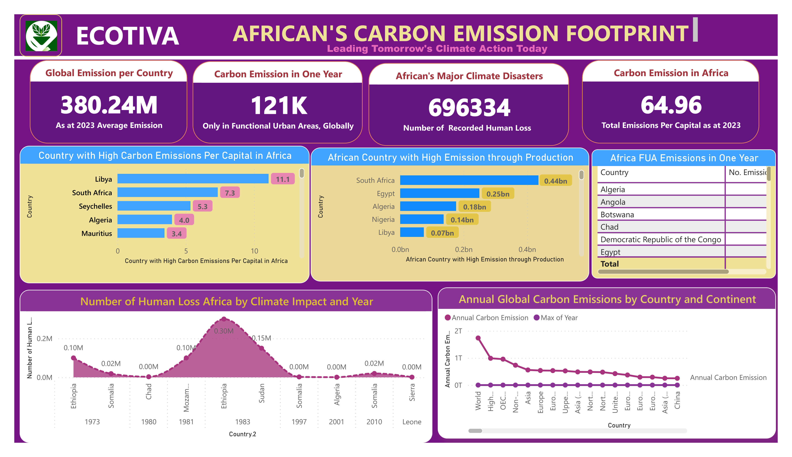
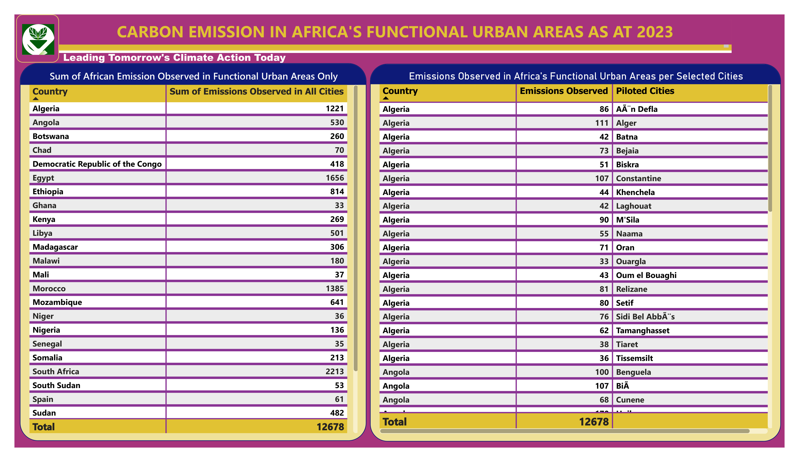
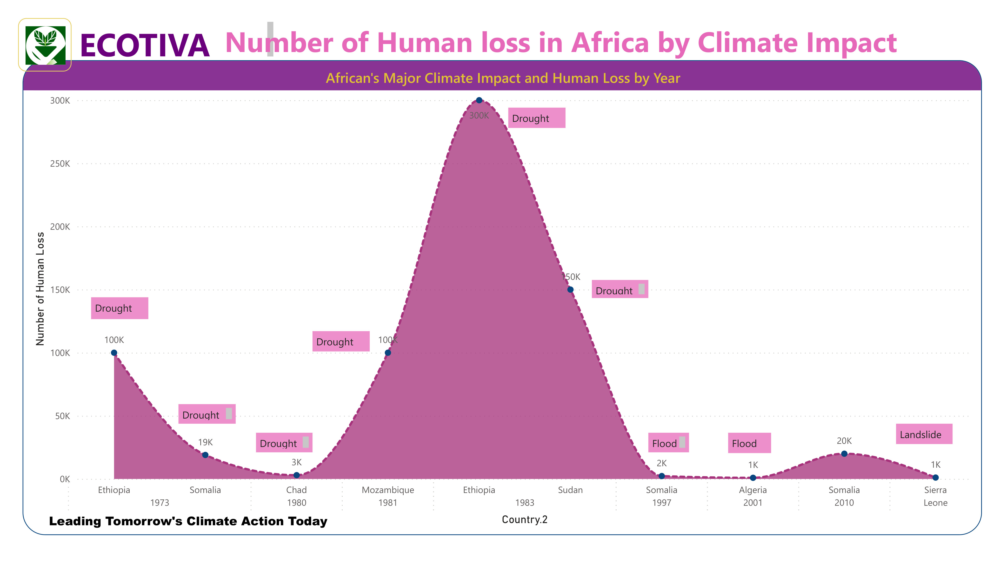
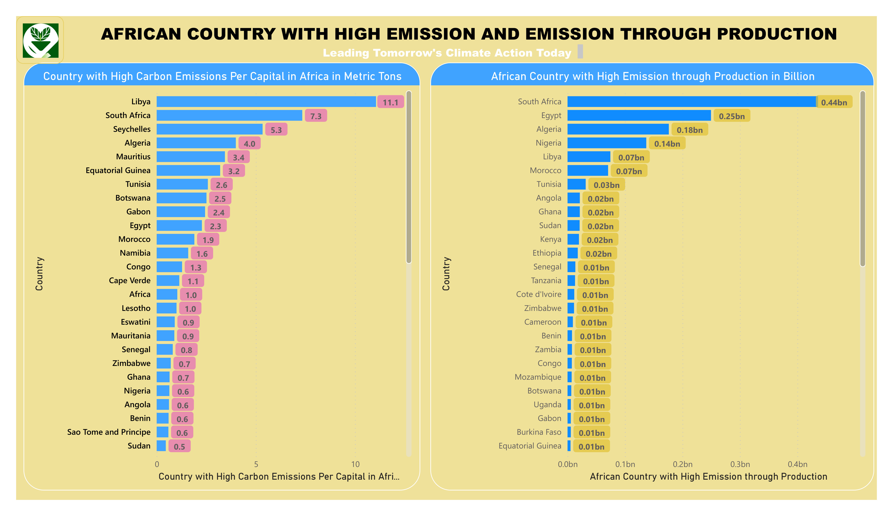
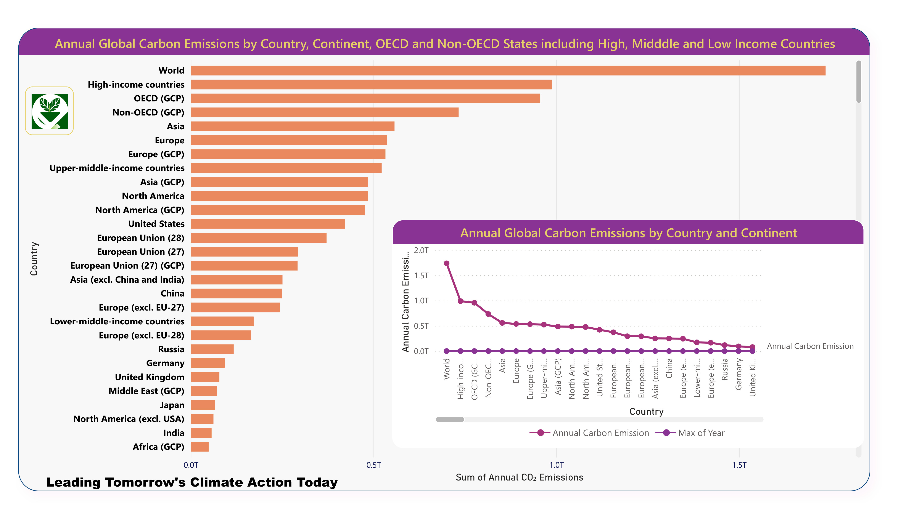

# African-Carbon-Emissions-A-Power-BI-Analysis
Explore African carbon emissions data in 2023 with Power BI Desktop visualizations. Understand environmental impact and climate change trends.

# OVERVIEW 
Visualisation of African carbon emissions using Power BI. Explore climate data, urban emissions, and high-impact regions. Act on climate change.

Certainly, here are headings for your article with suggested picture captions for your GitHub readme:

1. **Global Emissions Overview**

2. **Carbon Emissions in Functional Urban Areas**

Almost all African countries contribute less to GHGs globally

3. **African Climate Disasters**

Drought is revealed as the leading climate impact leading into hundreds of deaths in Africa.

5. **High Carbon Emissions Per Capita in African Countries and  Emission through Production**

Lybia is seen as the leading country whiles South Africa contributes more emission through production.

8. **Conclusion**

African is disaporpriately affect from the analysis.

## Contact 🔭
`Richard Mensah`

`Data Analystics Professional`

`Azubi Africa`

 